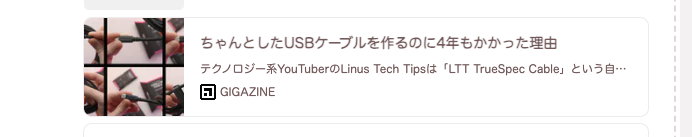
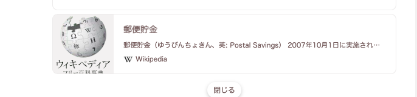
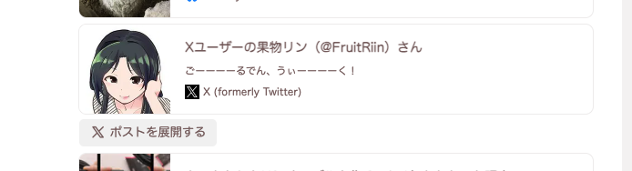
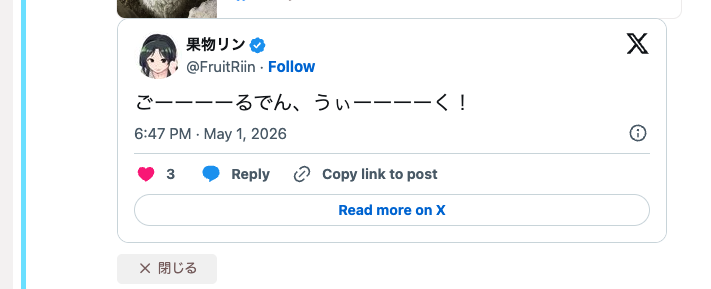

riin-summaly
================================================================

[![][npm-badge]][npm-link]
[![][mit-badge]][mit]
[![][himawari-badge]][himasaku]
[![][sakurako-badge]][himasaku]

**summaly は Misskey の note プレビューカードを生成しているライブラリ／HTTP サーバ** です。`riin-summaly` は [misskey-dev/summaly](https://github.com/misskey-dev/summaly) の fork で、本家にはまだ取り込まれていない**運用機能**（in-flight dedup・TOML 設定・JSONL 永続化・twitter プラグイン・dev UI など）を先行実装しています。Misskey 管理人として **「自分で動かして自分の運用に効く改善を入れたい」** 用途を想定しています。

<table>
<tr>
<td></td>
<td></td>
</tr>
<tr>
<td></td>
<td></td>
</tr>
</table>

URL から `title` / `description` / `thumbnail` / `icon` / `sitename` / 埋め込みプレーヤー / `medias[]`（複数画像） / ActivityPub リンク / fediverse creator 等を抽出して JSON で返します。Misskey サーバはこの JSON を受け取って上図のようなカード UI を組み立てます。

---

何ができるか
----------------------------------------------------------------

### 基本機能（本家と同等）

- **OpenGraph / Twitter Card / oEmbed / `<title>` / `<meta>`** から優先順位付きでメタ情報抽出
- **サイト固有プラグイン** で高速・正確な結果（YouTube・Spotify は oEmbed 直叩き、Wikipedia は MediaWiki API、Amazon は DOM 直接抽出など）
- **多文字コード対応**: UTF-8 / Shift_JIS / ISO-2022-JP（`jschardet` + `encoding-japanese`、[issue #39](https://github.com/misskey-dev/summaly/issues/39)）
- **SSRF 対策**: プライベート IP 拒否・レスポンスサイズ上限（10 MiB）・結果 URL のスキーム検証（`javascript:` / `data:` の sanitize）
- **PDF レスポンスのタイトル取得**（オプトイン、5 層のハング対策付き）

### riin-summaly で拡張された運用機能

| 機能 | 概要 | 関連 |
|:--|:--|:--|
| **インメモリ LRU キャッシュ** | `Cache-Control` を解釈しない HTTP クライアント（Misskey の Got 等）でも summaly サーバ単独で重複アクセスを抑える | `inMemoryCache` |
| **in-flight dedup** | Misskey ユーザーストリーミング由来の **thundering herd を 1 本化**。同 URL の並列リクエストは先頭リクエストの結果を共有し origin への同時アクセスを 1 件に絞る | `inFlightDedup`、`X-Cache: HIT-COALESCED` |
| **TOML 設定ファイル** | `pnpm serve config.toml` で起動。コメント・セクション分割が書ける運用設定 | `config.example.toml` |
| **dev サーバ UI** | `pnpm dev` で `http://127.0.0.1:3000`。URL を入れて JSON / Misskey 風カード / iframe プレーヤーを並列確認、サンプル URL ワンクリック | tsx + Vanilla JS |
| **パース失敗ログ集約** | 「OG/Twitter Card/`<title>` のいずれも取れず汎用パスでスカスカになった URL」を host + path 単位で集約。**プラグイン化候補のドメイン発見器**。集約データは JSONL ファイルに `cat \| jq` でアクセス（HTTP エンドポイントは phase11.5 で廃止） | `[diagnostics] parseFailureLog`、`parseFailureLogJsonlPath` |
| **短縮 URL の HEAD→GET fallback** | `amzn.asia` のように HEAD に 404 を返すサーバを GET fallback で正しく解決 | `KNOWN_SHORT_HOSTS` |
| **twitter (X) プラグイン** | `cdn.syndication.twimg.com` 直叩きで本文 + thumbnail + `medias[]` を返す。**player は null**（Misskey 側「ポストを展開」と重複しないように） | `(twitter\|x).com/<user>/status/<id>` |

---

riin-summaly vs 本家 (misskey-dev) vs mei23-summaly
----------------------------------------------------------------

| 項目 | riin-summaly | misskey-dev (本家) | mei23-summaly |
|:--|:---:|:---:|:---:|
| ベースバージョン | v5.3+ | v5.x | v3 |
| インメモリ LRU キャッシュ | ✅ | 対応予定 | ✅ |
| in-flight dedup（並列リクエスト 1 本化） | ✅ | — | — |
| TOML 設定ファイル | ✅ | (JSON) | (JSON) |
| dev サーバ UI | ✅ | — | — |
| パース失敗ログ集約 + JSONL 永続化 | ✅ | — | — |
| 短縮 URL HEAD→GET fallback (`amzn.asia` 等) | ✅ | — | — |
| 多文字コード（Shift_JIS / ISO-2022-JP） | ✅ | 対応予定 | ✅ |
| プラグインシステム | ✅ | ✅ | ✅ |
| youtube / youtu.be | ✅ | プレビューなし | ✅ |
| amazon | ✅ (`amzn.asia` 含む) | 基本対応 | 基本対応 |
| twitter (X) | ✅ (本文 + medias[]、player は null) | 汎用パス（薄い） | ✅ (本文のみ) |
| PDF タイトル取得（オプトイン） | ✅ | — | — |

---

Misskey 管理人として導入する場合
----------------------------------------------------------------

スタンドアロンの Fastify サーバとして起動し、Misskey 本体から `GET /?url=...` を呼ぶ構成が標準です。

```bash
git clone https://github.com/fruitriin/summaly.git
cd summaly
pnpm install --frozen-lockfile
pnpm build
cp config.example.toml config.toml   # TOML 設定をコピーして編集
pnpm serve config.toml               # = tsx bin/summaly-server.ts config.toml
```

最小設定例 (`config.toml`):

```toml
[server]
host = "127.0.0.1"
port = 3000

[summaly.cache]
inMemory = true        # Misskey の Got/node-fetch は Cache-Control を解釈しないため事実上必須
inFlightDedup = true   # ユーザーストリーミング由来の thundering herd を緩和

[plugins]
allowed = ["amazon", "bluesky", "wikipedia", "branchio-deeplinks", "youtube", "spotify", "twitter"]
```

詳細なセットアップ手順、TOML 設定スキーマ、Fastify モード固有のオプション（キャッシュ・PDF・プラグイン絞り込み・パース失敗ログ・nginx + systemd デプロイ例）、SSRF 既定値、運用上の注意点は **[docs/SETUP.md](docs/SETUP.md)** を参照してください。

---

対応サイト（プラグイン一覧）
----------------------------------------------------------------

サイト固有プラグインは登録順にマッチし、最初に当たったものが採用されます。マッチしなかった URL は汎用パスで OG / Twitter Card / oEmbed から抽出されます。

| プラグイン | 対象 | 概要 |
|:--|:--|:--|
| `amazon` | `www.amazon.{com, co.jp, ...}` | DOM から商品タイトル・画像を直接取得。`amzn.asia` / `amzn.to` / `a.co` 短縮も HEAD→GET fallback で展開 |
| `bluesky` | `bsky.app` | HEAD が 404 になるため GET のみで取得 |
| `wikipedia` | `*.wikipedia.org` | MediaWiki API から intro テキスト取得 |
| `branchio-deeplinks` | `*.app.link` / `spotify.link` | `$web_only=true` を付けて Web 版にリダイレクトさせ汎用パスへ |
| `youtube` | `(www\|m).youtube.com/{watch,v,playlist,shorts}` / `youtu.be` | oEmbed エンドポイント直叩きで 1 リクエスト |
| `spotify` | `open.spotify.com` | oEmbed エンドポイント直叩き |
| `twitter` | `(twitter\|x).com/<user>/status/<id>` | `cdn.syndication.twimg.com` から JSON 取得して title/description/thumbnail を返す。複数画像は `medias[]`、player は null（Misskey の「ポストを展開」と重複しないため）。**X 側仕様変更で壊れうるため要メンテ** |
| `dlsite` | `www.dlsite.com` | `/announce/` ↔ `/work/` の 404 リトライ + パス分類で sensitive 判定 |
| `iwara` | `(www\|ecchi).iwara.tv` | description / thumbnail を DOM から補完、`ecchi.` ホストで sensitive |
| `komiflo` | `komiflo.com/comics/<id>` | thumbnail フォールバック時に `api.komiflo.com` から取得 + sensitive |
| `nijie` | `nijie.info/view.php` | JSON-LD `ImageObject` から description / thumbnail を補完 + sensitive |

各プラグインの詳細仕様、カスタムプラグインの書き方、共通ユーティリティは **[docs/Plugins.md](docs/Plugins.md)** にあります。

---

ライブラリとして直接利用する場合
----------------------------------------------------------------

Node.js プロジェクト内で `summaly()` 関数を直接 import して使うこともできます。Fastify モード専用の機能（`inFlightDedup` / `inMemoryCache` / `parseFailureLog` 等）は無効ですが、URL → SummalyResult の関数だけが欲しい場面で使えます。API リファレンス・戻り値型・全オプションは **[docs/Library.md](docs/Library.md)** を参照してください。

```javascript
import { summaly } from 'summaly';
const summary = await summaly('https://example.com/article');
console.log(summary.title, summary.description, summary.thumbnail);
```

---

開発
----------------------------------------------------------------

```bash
pnpm install
pnpm build              # tsdown で ./built に出力
pnpm test               # vitest（200+ ケース）
pnpm eslint             # ESLint
pnpm typecheck          # tsc --noEmit (src + test + dev/bin の 3 構成)
pnpm serve config.toml  # Fastify サーバ起動（TOML 設定）
pnpm dev                # 動作確認 UI（http://127.0.0.1:3000、tsx で src/ を直接実行）
```

### 動作確認 UI (`pnpm dev`)

`pnpm dev` で `http://127.0.0.1:3000` に動作確認用の Web UI が立ち上がります。本番 bundle (`./built/`) には含まれない dev 専用ツールです。

- 左ペインに **JSON 常時表示**、右ペインに **Misskey 風カードプレビュー** / **iframe プレーヤー** のタブ
- 組み込みプラグイン対応サイトのサンプル URL を**ワンクリック**で入力欄に流し込める（PDF サンプルは `enablePdf` も自動 ON）
- `lang` / `useRange` / `enablePdf` / `allowedPlugins` を**リクエスト単位**で切り替え可能
- ローカル URL をプレビューできるよう `SUMMALY_ALLOW_PRIVATE_IP=true` を **dev サーバ内に閉じて** 設定（シェル env を汚染せず、`pnpm serve` 本番には影響しない）
- iframe は `referrerpolicy` を browser default に戻し、YouTube oEmbed の「エラー 153」を回避

`PORT` / `HOST` 環境変数で待ち受けを変更可能（デフォルト `127.0.0.1:3000`）。

### 設計ドキュメント

- **[docs/SETUP.md](docs/SETUP.md)**: 本番運用ガイド（TOML 設定・キャッシュ戦略・パース失敗ログ・nginx/systemd 例）
- **[docs/Plugins.md](docs/Plugins.md)**: プラグイン詳細仕様・カスタムプラグインの書き方
- **[docs/Library.md](docs/Library.md)**: `summaly()` 関数の API リファレンス
- **[docs/knowhow/](docs/knowhow/)**: 実装中に蓄積した設計知見（in-flight dedup・TOML loader・dev サーバ・パース失敗ログ等）
- **[docs/plans/](docs/plans/)**: 各 phase の設計プラン（実装の意思決定の経緯）

---

ライセンス
----------------------------------------------------------------

[MIT](LICENSE)

[mit]:            http://opensource.org/licenses/MIT
[mit-badge]:      https://img.shields.io/badge/license-MIT-444444.svg?style=flat-square
[himasaku]:       https://himasaku.net
[himawari-badge]: https://img.shields.io/badge/%E5%8F%A4%E8%B0%B7-%E5%90%91%E6%97%A5%E8%91%B5-1684c5.svg?style=flat-square
[sakurako-badge]: https://img.shields.io/badge/%E5%A4%A7%E5%AE%A4-%E6%AB%BB%E5%AD%90-efb02a.svg?style=flat-square
[npm-link]:       https://www.npmjs.com/package/@misskey-dev/summaly
[npm-badge]:      https://img.shields.io/npm/v/@misskey-dev/summaly.svg?style=flat-square
